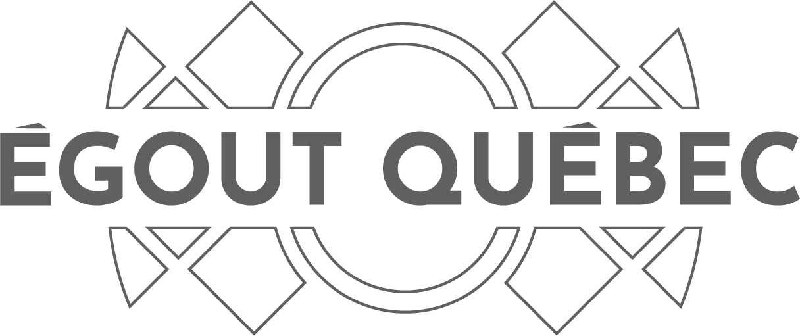

  

<h1>Mission</h1>

ÉGOUT QUEBEC permet de prédire le débordement des égouts et d’en avertir les amateurs d’activités aquatiques. Ainsi les personnes désirant aller faire des activités aquatiques pourrons éviter les zones polluées par les déversements d’eau usée. De plus, des conseils seront dispensés aux gens des différents quartier, de façon à réduire les risques de débordement.  ÉGOUT QUEBEC utilise une technologie basée sur une intelligence artificielle. Celle-ci peut déterminer lorsque les égouts déborderont. Ses analyses et calculs sont basés sur des données disponibles sur le site de <a href ="https://www.donneesquebec.ca/fr/"> donnée Québec</a> .Finalement, les différentes villes auront avantage à utiliser ÉGOUT QUEBEC. Grâce aux prédictions et aux analyses de la plateforme, il sera possible de concentrer les ressources de la ville aux endroits les plus problématique.

<figure>

    <figcaption>Exemple de débordement causé par la pluie</figcaption>
</figure>
<h1>Recommendations</h1>
<ol>
<li>
Évitez les contacts avec l’eau polluée puisqu’elle peut rendre les humains et les animaux malades. En effet le niveau bactéries mesuré provenant des déchets des humains, animaux et matières résiduelles dans l’eau est plus élevé jusqu’à 48h après un débordement. Cette hausse de bactéries peut être la cause de différentes infections tel que E Colis, trachoma ainsi que l’hépatite A pour n’en nommer que quelques-unes. De plus, les eaux peuvent avoir une odeur nauséabonde, ce qui rends les activités aquatiques bien moins agréable. </li>

<li>Les systèmes d’aqueduc et de filtration reçoivent l’eau à la fois de sources commerciaux, domestique et industriels. Lors des périodes de grandes pluies, il n’est pas rare que les systèmes soient débordés. En limitant votre apport en eau usée au système de filtration il est possible de réduire la gravité voir même éviter un débordement. Parmi les activités à éviter, les suivantes sont faciles à déplacer : utilisation de la douche, de la machine à laver et de la laveuse.
</li>
</ol>
<h1></h1>
<h1>Technologie</h1>

Les analyses et prédictions de ÉGOUT QUEBEC permettent à la ville de mieux concentrer ses ressources sur les zones à risque. De cette façon le système est constamment amélioré et la fréquence de débordement tend à diminuer.

<h4>Intelligence Artificielle</h4>

Grâce au donnée généreusement fournis par la ville de Montréal, ÉGOUT QUÉBEC est en mesure d'apprendre des donnée pluviomètrique et des donnée de débordemnt pour prédire ou et quand les débordements auront lieu

<h4>Données Utilisé</h4>

ÉGOUT QUÉBEC utilise les données en libre accès disponible sur le site de <a href="https://www.donneesquebec.ca/fr/">donnée Québec</a>. Nous y avons pris les jeux de données suivants : Débordement (1) - Localisation des pluviomètres (2) - Liste des ouvrages de surverses (3)

<h4>Outils Informatique Utilisé</h4>
<ul>
  <li>Pandas (Python3.6)</li>  
  <li>Numpy (Python3.6)</li>  
  <li>Scipy (Python3.6)</li>
  <li>Sklearn (Python3.6)</li>
  <li>Sklearn - DecisionTreeRegressor Package (Python3.6)</li>
  <li>MATLAB 2018a Machine Learning Regression Library (MATLAB2018a)</li>
  <li>Rails (Ruby2.5.1.)</li>
  <li>Leaflet.js (6) (javascript) </li> 
  <li>Bootstrap (Web)</li>
</ul>
<h1>Références</h1>
<ol>
<li><a href = "https://www.donneesquebec.ca/recherche/fr/dataset/vmtl-debordement">Donnée de débordement Montréal 2017</a></li>
<li><a href = "https://www.donneesquebec.ca/recherche/fr/dataset/vmtl-pluviometre">Donnée des pluviomètres de Montréal 2017</a></li>
<li><a href = "https://www.donneesquebec.ca/recherche/fr/dataset/vmtl-ouvrage-surverse">Donnée d'ouvrage de surverse Montréal 2017</a></li>
<li><a href = "https://utilitieskingston.com/Wastewater/SewerOverflow/FAQ">Kingsont sewer overflow</a></li>
<li><a href = "http://www.waterkeeper.ca/toronto-sewage/">Toronto sewer overflow</a></li>
  <li><a href = "https://leafletjs.com/">Leaflet.js</la></li>
<li><a href = "https://aquahacking.com/medias/content/images/photos/CSO_diagram_US_EPA.jpg">Image débordement</a></li>
</ol>
<i>Contactez-nous à egoutquebec@gmail.com</i>
